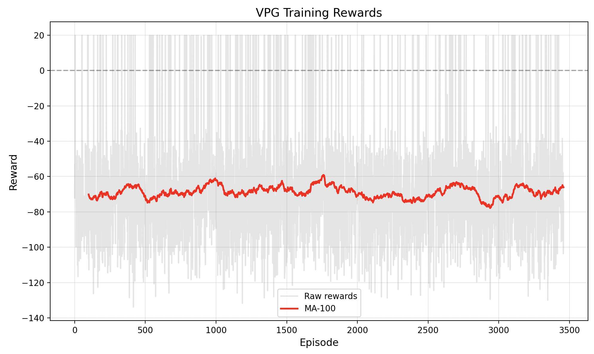
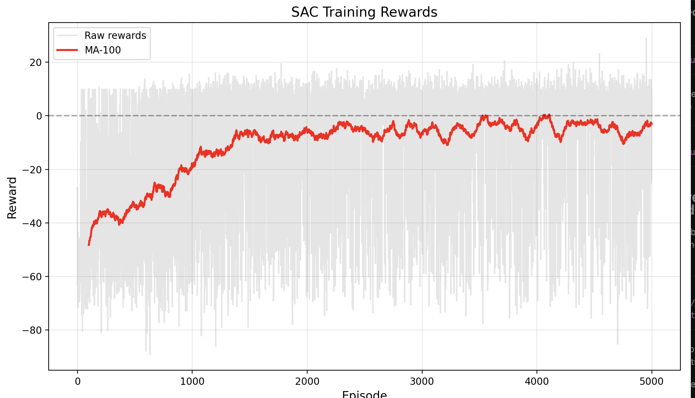
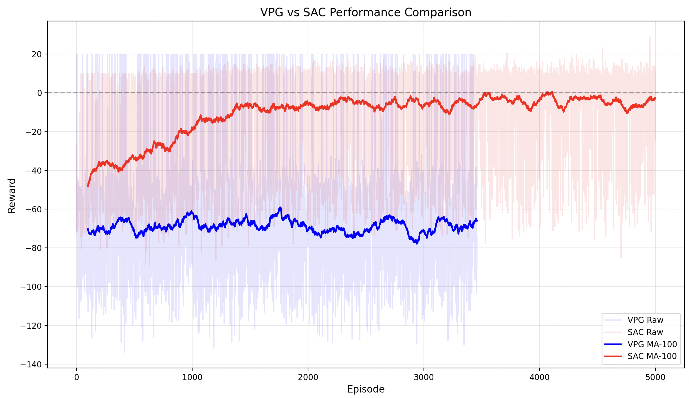

# -batuhansolmaz-cmpe591-hw3

### Vanilla Policy Gradient (VPG)
A classic policy gradient method with baseline value function for variance reduction. Our implementation includes:
- Experience replay buffer for more stable learning
- Adaptive exploration
- Reward shaping specific to VPG
- Learning rate scheduling

### Soft Actor-Critic (SAC)
A state-of-the-art off-policy algorithm that optimizes a stochastic policy with entropy regularization. Features:
- Twin Q-networks to reduce overestimation bias
- Automatic entropy tuning
- Separate actor and critic networks

## Results

### VPG Training Performance

### SAC Training Performance

### Algorithm Comparison

## Usage

### Training

To train a model using VPG:

python hw3/homework3.py --algorithm vpg --episodes 5000

python hw3/homework3.py --algorithm sac --episodes 5000

### Testing

To test a trained VPG model:

python hw3/homework3.py --test vpg.pt

python hw3/homework3.py --test sac.pt
